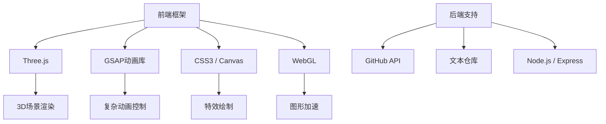
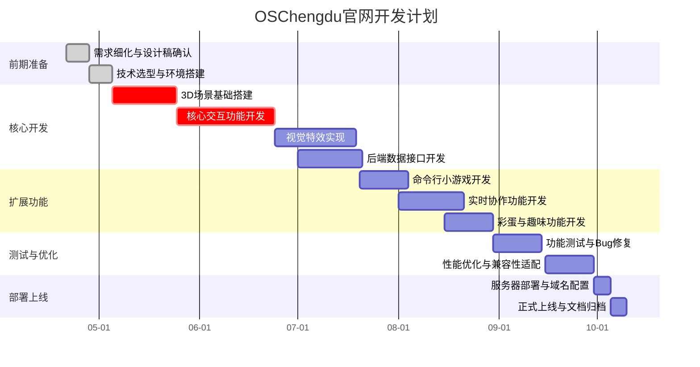

# OSChengdu开源组织官网开发

## 项目概述

OSChengdu官网旨在打造一个沉浸式交互空间，融合创新的视觉风格与科技感。访问者可探索交互式3D元素，体验科幻风格的视觉特效，同时深入了解开源社区文化与项目成果。

## 技术栈



## 功能模块

| 模块           | 描述                                                         |
| -------------- | ------------------------------------------------------------ |
| **工作室场景** | 等高推车（成员档案）、量子计算机（Docker终端）、电工桌（博客/专题文章）、魔法传送门（友站链接） |
| **视觉特效**   | 蜘蛛侠平行宇宙风格（色散/错位）、赛博朋克灯光（霓虹渐变+Low Poly） |
| **交互功能**   | 3D物品旋转/拖拽、命令行小游戏、声控灯光、实时协作光标等      |
| **创意彩蛋**   | 开源燃料罐（贡献排行榜）、故障公告板、兔子洞彩蛋、隐藏Boss等 |

## 开发计划



## 开发流程

我们采用基于GitHub Flow的开发流程：

1. **主分支保护**：`main` 分支受保护，仅用于部署，禁止直接提交代码

2. 功能分支开发

   ：

   - 每个功能模块创建独立分支（如 `feature/3d-scene`）
   - 提交代码时使用规范化的commit信息

3. 代码审查

   ：

   - 功能完成后，创建Pull Request进行代码审查
   - 通过自动化测试和人工审查后方可合并

4. 持续集成

   ：

   - 合并至`main`分支后自动触发CI/CD流程
   - 自动部署至测试/生产环境

5. 紧急修复

   ：

   - 线上问题通过`hotfix`分支快速修复并合并回主分支

## 任务分工

| 阶段       | 任务                           | 负责人 | 预计耗时 |
| ---------- | ------------------------------ | ------ | -------- |
| 前期准备   | 需求文档撰写、设计稿确认       | 开发者 | 2周      |
| 核心开发   | 3D场景搭建、交互逻辑开发       | 开发者 | 8周      |
| 扩展功能   | 彩蛋与趣味功能实现             | 开发者 | 4周      |
| 测试与优化 | 全流程测试、性能调优           | 开发者 | 3周      |
| 部署上线   | 服务器配置、域名绑定、文档整理 | 开发者 | 1周      |

## 快速开始

### 环境要求

- Node.js >= 16.x
- npm >= 8.x
- 现代浏览器（支持WebGL）

### 安装与运行

```bash
git clone https://github.com/oschengdu/website.git
cd website
npm install
npm run dev
```

### 构建生产版本

```bash
npm run build
```

## 协作与沟通

- **任务追踪**：使用GitHub Issues管理任务和Bug
- **即时沟通**：Discord频道进行团队协作
- **进度同步**：每周更新GitHub Project看板
- **风险控制**：预留10%缓冲时间应对技术难点

## 贡献指南

我们欢迎各类贡献，包括但不限于：

- 代码贡献（功能开发、Bug修复）
- 文档改进
- 设计优化
- 创意提案

请查看[CONTRIBUTING.md](https://sourcegraph.com/cody/chat/MjAyNC0wNS0yN1QyMjowMjoyNC4wMTVa?signin=OpenIDConnect&signin=OpenIDConnect)了解详细贡献流程。

## 许可证

本项目采用[MIT许可证](https://sourcegraph.com/cody/chat/MjAyNC0wNS0yN1QyMjowMjoyNC4wMTVa?signin=OpenIDConnect&signin=OpenIDConnect)。

© 2025 OSChengdu开源组织 - 用代码连接开源世界
