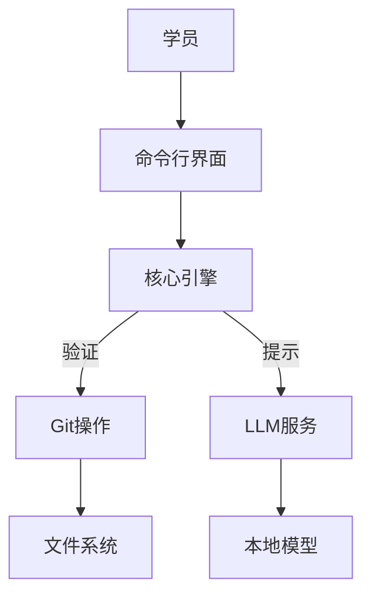

# Gitlings - Git教学工具


## 技术架构



## 核心功能

### 1. Git对象可视化

解析四种基本Git对象：

```rust
pub enum GitObject {
    Blob(Vec<u8>),
    Tree(Vec<TreeEntry>),
    Commit(CommitData),
    Tag(TagData),
}
```

### 2. 错误注入系统

典型场景示例：

```python
# 损坏的tree对象
with open(".git/objects/ab/cdef", "w") as f:
    f.write("CORRUPTED_DATA") 

# 触发验证
gitlings verify
```

### 3. AI提示系统

三级提示策略：

1. **概念提示**：解释git commit的作用
2. **命令提示**：建议使用`git commit -m "message"`
3. **分步演示**：展示完整提交流程动画

## 部署方式

```bash
# 安装
cargo install --git https://github.com/OSchengdu/gitlings

# 启动
gitlings start --exercise=basic_commit
```

[项目仓库](https://github.com/OSchengdu/gitlings) | [演示视频](#)
